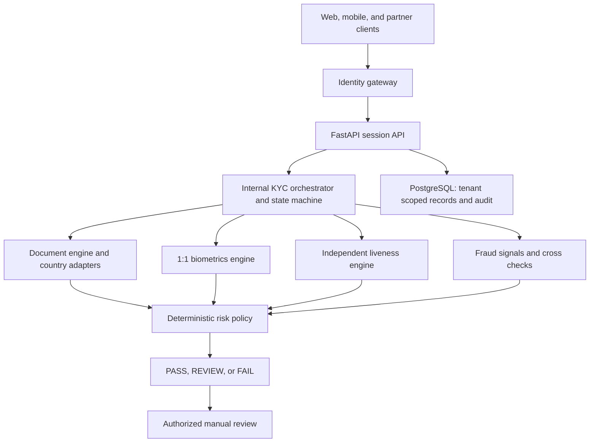
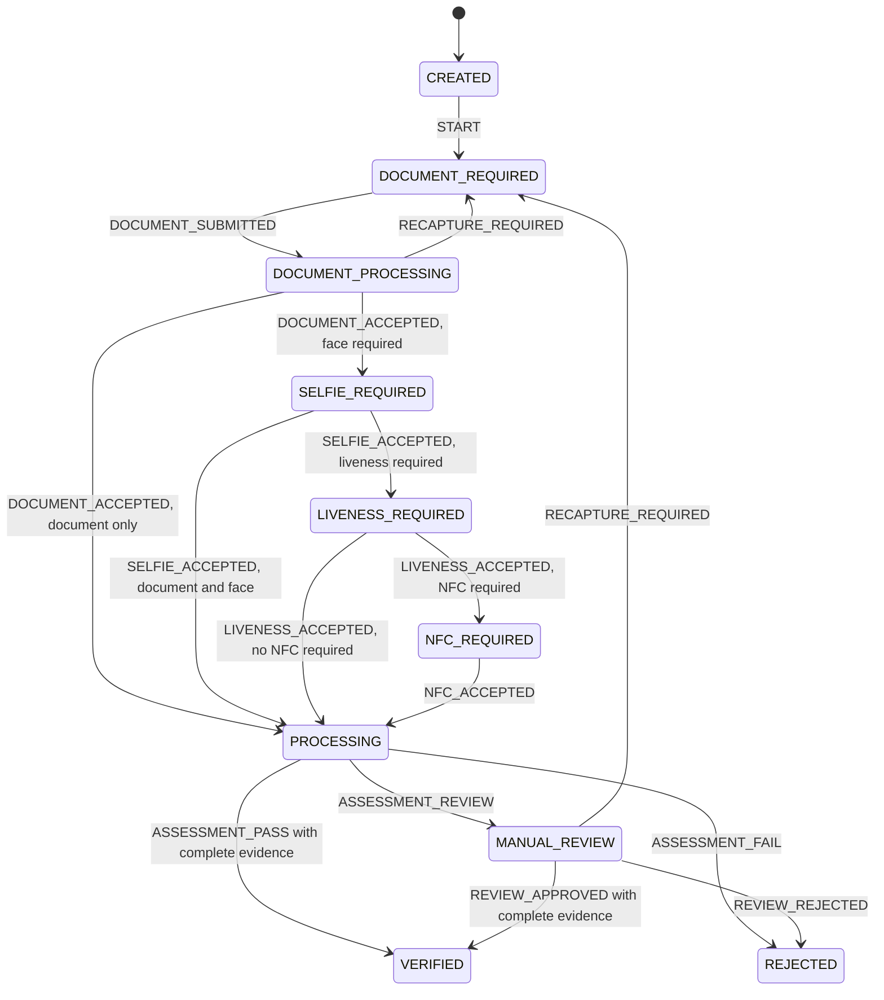

# Phase 1 — architecture, schema, and session lifecycle

This phase establishes the service boundaries, PostgreSQL data model, migration,
and KYC session lifecycle. It does not perform document authenticity verification,
OCR, face comparison, or liveness detection. Their interfaces are defined;
implementations follow the approved phase order in `Document.md`.

## Design

The API and state machine are implemented in Phase 1. Engine boxes describe later
phases; a planned adapter is explicitly reported as `PLANNED` by the API. A
general-purpose LLM has no authority to mark a session verified.

Document adapters own country-specific layout, OCR extraction, MRZ/QR handling,
portrait location, and security checks. The core OCR interface only receives
images and language choices. Canonical fields are nullable when a document does
not provide them. Raw OCR values, normalized values, Khmer Unicode, bounding boxes,
and confidence are preserved without replacing a low-confidence value.

The document, biometric, liveness, fraud, and risk contracts have separate entry
points. Future Pub/Sub messages carry session/organization IDs and versioned
events, rather than raw captures or biometric templates. Heavy model execution
belongs in workers, not the HTTP request process.

## Session lifecycle

Any active status can expire. `VERIFIED`, `REJECTED`, and `EXPIRED` are terminal;
retrying a terminal session requires creating a new UUID4 session. On reads, an
expired active session becomes `EXPIRED` in the same transaction as its audit
record. An expiry sweep/worker is a later integration; Phase 1 does not claim a
scheduled expiration service.

Events are server-side operations, never partner-supplied status updates. Positive
terminal transitions require explicit document and policy evidence, plus face,
liveness, and NFC evidence when the chosen verification level requires them.
All evidence defaults to false. No percentages or biometric thresholds are
invented. Trusted worker evidence and calibrated, versioned policies are later
phase integrations.

The service acquires the session row with `SELECT ... FOR UPDATE` for reads that
can expire a session. Internal event writers must acquire the same lock, update
the version, and record the event transactionally. A version field prepares the
contract for future asynchronous worker concurrency and stale-event rejection.

## Database and sensitive data

The initial migration creates the sixteen requested tables plus `organizations`:

| Group | Tables |
| --- | --- |
| Session ownership | `organizations`, `kyc_sessions` |
| Documents | `identity_documents`, `document_images`, `document_fields`, `document_checks` |
| Independent sources | `mrz_results`, `barcode_results`, `nfc_results` |
| Biometrics | `biometric_templates`, `face_comparisons`, `liveness_checks` |
| Decisions | `fraud_signals`, `risk_assessments`, `manual_reviews` |
| Consent and audit | `consents`, `audit_logs` |

Public session IDs are UUID4. Every artifact contains organization and session
context. Composite foreign keys prevent cross-tenant links and prevent a document
field or face comparison from referring to a different session's evidence.
Tenant/session foreign keys have matching indexes, including the document and
template references actually used in queries and deletion checks.

PostgreSQL RLS is enabled and forced on every tenant table. The API uses
`set_config('app.organization_id', ..., true)` inside a transaction, preventing
tenant context from persisting on reused connections. API queries also explicitly
filter by credential-bound organization. Unknown and foreign session IDs both
return 404.

The local API database role is `NOSUPERUSER` and `NOBYPASSRLS`. Its privileges are
limited to the Phase 1 operations. It can append audit events, but cannot update
or delete them. Migration credentials are separated from the API process. Audit
records retain pseudonymous session references after session deletion and omit
extracted identities, captures, templates, API keys, and raw OCR text.

PII-bearing field values and review notes have ciphertext columns and key-version
metadata; biometric templates have dedicated encrypted columns and expiry
metadata. There are no public writes to these tables in Phase 1. The schema is an
encryption boundary, not an implemented encryption provider. Cloud KMS, GCS IAM,
signed URLs, retention workers, and key rotation are implemented and validated in
their later phases. Plain hashes do not replace document-number HMACs.

The canonical identity model is an internal extraction contract and is not exposed
by the session API. Result responses contain null document, identity, and decision
fields while no verification evidence exists.

## Authentication boundary

Phase 1 uses one generated development credential bound to one configured
organization. `X-API-Key` authenticates the credential; `X-Organization-ID` must
match its organization. A caller cannot select a different tenant by changing a
header. This is a local gateway foundation; multi-tenant credential provisioning,
revocation, scopes, and reviewer permissions are Phase 15 work.

Production mode fails configuration validation until the later authentication and
security phases are approved and completed. API error responses omit submitted
values, and database errors do not disclose SQL or credentials. HTTP responses
use `Cache-Control: no-store`; access logs are disabled in the provided launch
commands to avoid exposing session URLs.

## GCP deployment plan

Phase 19 deploys the API to Cloud Run and workers behind Pub/Sub, using Cloud SQL
PostgreSQL, Memorystore, separate encrypted capture/biometric GCS buckets, Secret
Manager, Cloud Logging, and Cloud Monitoring. Workload service accounts and KMS
keys will be scoped to their data domains. Cloud Run maximum instances and each
instance's database pool must fit the Cloud SQL connection budget.

No GCP resources have been created. The Docker image contains the Phase 1 API and
migrations, runs as an unprivileged user, honors `PORT`, and never performs schema
changes on API startup.

## Source references

- [SQLAlchemy declarative tables and type mapping](https://docs.sqlalchemy.org/en/20/orm/declarative_tables.html)
- [Alembic offline SQL generation](https://alembic.sqlalchemy.org/en/latest/offline.html)
- [FastAPI lifespan handling](https://fastapi.tiangolo.com/advanced/events/)
- [PostgreSQL row security](https://www.postgresql.org/docs/current/ddl-rowsecurity.html)
